```
                        ____   _____ _____   
                      / __ \ / ____|_   _|  
                     | |  | | |      | |    
                     | |  | | |      | |    
                     | |__| | |____ _| |_   
                      \____/ \_____|_____|  
                                                                                         
 _    _                 _        ____          _           _     
| |  | |               | |      / __ \        | |         | |    
| |__| | __ _ _ __   __| |___  | |  | |_ __   | |     __ _| |__  
|  __  |/ _` | '_ \ / _` / __| | |  | | '_ \  | |    / _` | '_ \ 
| |  | | (_| | | | | (_| \__ \ | |__| | | | | | |___| (_| | |_) |
|_|  |_|\__,_|_| |_|\__,_|___/  \____/|_| |_| |______\__,_|_.__/ 
```
***

# _Practice 02_ - Identity and Access Management

V1.2  
ORACLE LAB BOOK  |  FEBRUARY 2018


### Disclaimer

_The following is intended to outline our general product direction. It is intended for information purposes only, and may not be incorporated into any contract. It is not a commitment to deliver any material, code, or functionality, and should not be relied upon in making purchasing decisions. The development, release, and timing of any features or functionality described for Oracle’s products remains at the sole discretion of Oracle._
  
## Table of Contents

[Disclaimer](#Disclaimer)

[Overview](#Overview)

[Pre-Requisites](#Pre-Requisites)

[Practice 2-1: Signing in to the Console ](#Practice-2-1)

[Practice 2-2: Managing Users, Groups and Policies to Control Access](Practice-2-2)


## Overview

The Oracle Cloud Infrastructure Identity and Access Management (IAM) Service lets you control who has access to your cloud resources. You control the types of access a group of users has and to which specific resources.

The purpose of this lab is to give you an overview of the IAM Service components and an example scenario to help you understand how they work together.

## Pre-Requisites

· Oracle Cloud Infrastructure account credentials (User, Password, and Tenant)  

## Practice 2-1 
### __Signing in to the Console__

Overview

In this practice, you sign in to the Oracle Cloud Infrastructure console using your credentials.

Assumptions

**Note:** Some of the UIs might look a little different than the screenshots included in the instructions, but students can still use the instructions to complete the hands-on labs.

**Before You Begin**

To sign in to the Console, you need the following:

· Tenant, User name and Password

· URL for the Console: [https://console.us-ashburn-1.oraclecloud.com/](https://console.us-ashburn-1.oraclecloud.com/)

· Any browser from the supported browsers list (Recommended)

**Note:**

- **For this lab we use _cloud.admin_ and <your-name@oracle.com> as the user name to demonstrate the scenarios. You must use your cloud.admin when you perform these tasks.**

- Oracle Cloud Infrastructure supports the latest versions of Google Chrome, Firefox and Internet Explorer 11.

- When you are provisioned, you will receive a customized URL for your organization. For example, https://console.us-ashburn-1.oraclecloud.com_?tenant=<your-tenant-id>_

- If you omit the tenant argument, the system will ask you to input your tenancy before you can log in.

Duration: 5 minutes

Tasks

1. Sign In

   a) Open a supported browser and go to the Console URL. For example, [https://console.us-ashburn-1.oraclecloud.com](https://console.us-ashburn-1.oraclecloud.com).

   b) Enter your tenant name: <Tenant> and click Continue.

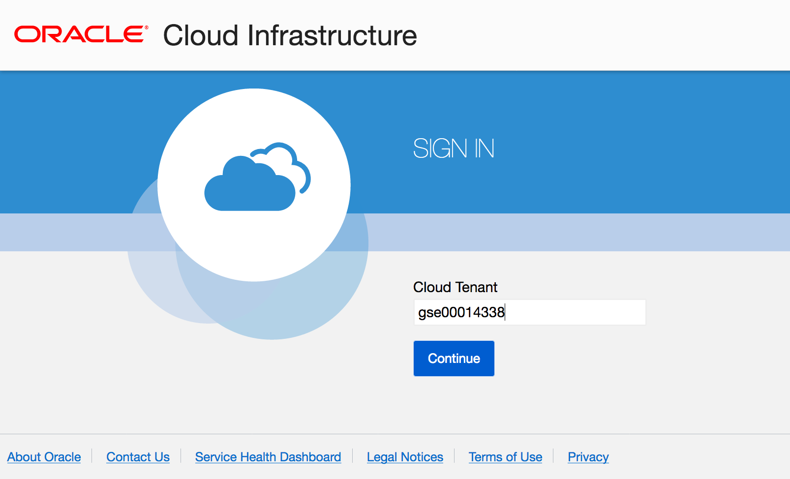

   c) Oracle Cloud Infrastructure is integrated with Identity Cloud Services, you will see a screen validating your Identity Provider. You can just click **Continue**.

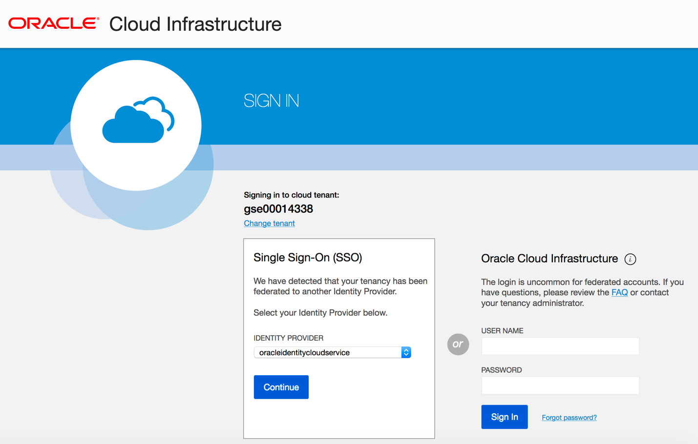

   d) Enter your user name and password

Username: cloud.admin

Password: <instructor will provide password>

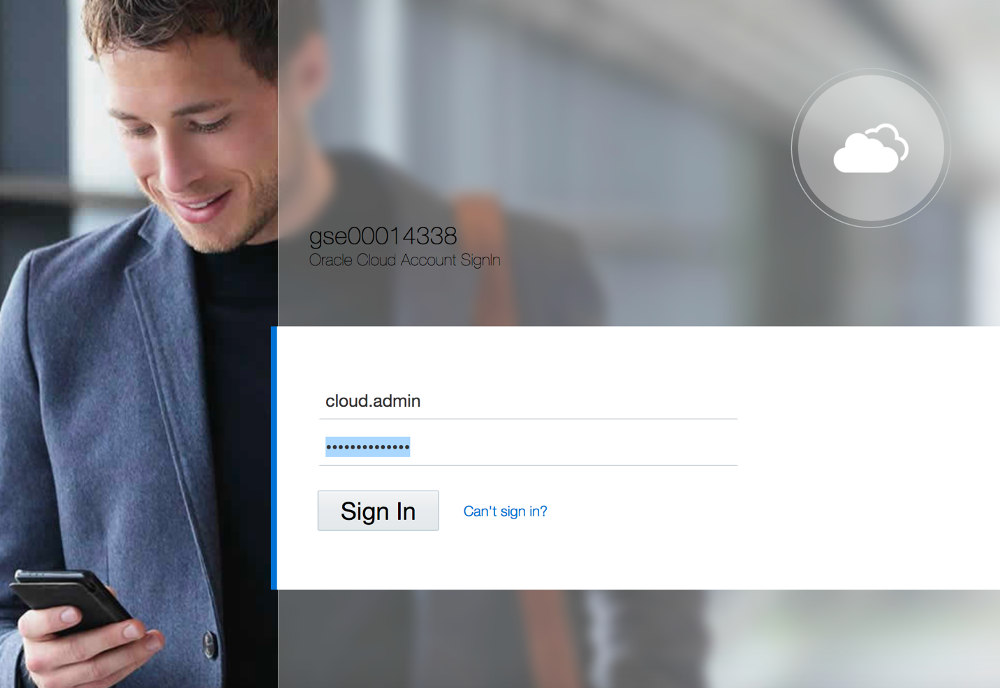

When you sign in to the Console, the home page is displayed.

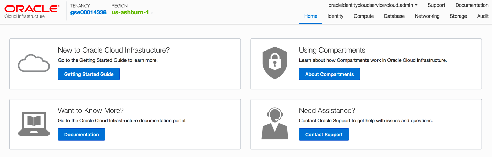

The home page gives you quick links to the documentation and to Oracle Support.

## Practice 2-2 
### ***Managing Users, Groups and Policies to Control Access***

#### Overview

A user's permissions to access services comes from the _groups_ to which they belong. The permissions for a group are defined by policies. Policies define what actions members of a group can perform, and in which compartments. Users can access services and perform operations based on the policies set for the groups of which they are members.

We'll create users, groups, and policies to understand the concept.

**Before You Begin**

You should have completed Practice 2-1.

Duration: 20 minutes

#### Tasks

1. Create a Group in Your Tenancy

   a) Sign in to the console, on the **Home** page click **Identity**, then select **Groups**.

   b)  Click **Create Group**.

   c) In the **Create Group** dialog box, enter the following:

1) **Name:** Enter a unique name for your group such as "oci-group” Note that the group name cannot contain spaces.

2) **Description:** Enter a description (for example, “New group for oci users”).

3) Click **Submit**.

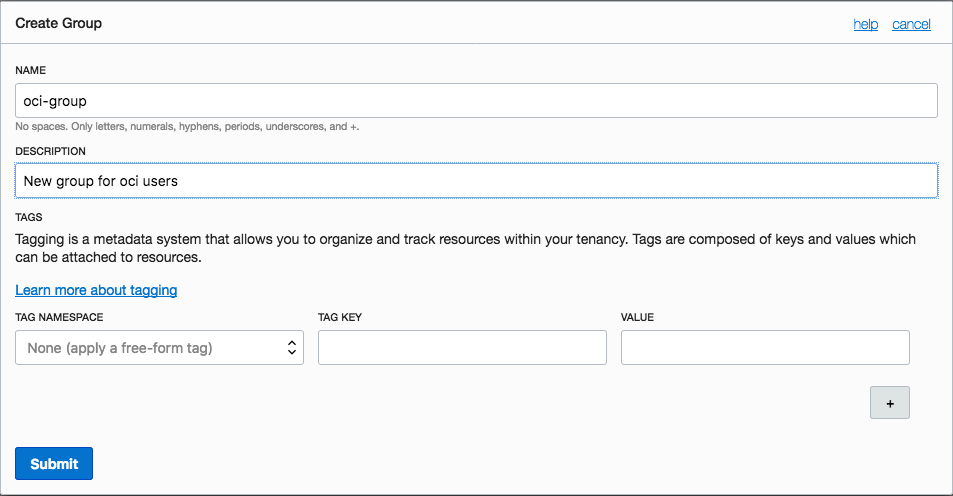

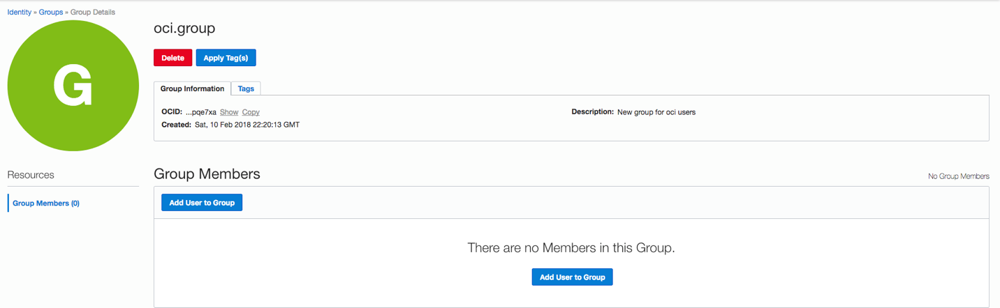

2. Create a **Compartment** in Your Tenancy

   a) On the **Home** page click **Identity**, then select **Compartments**.

   b) Click **Create Compartment.**

   c) In the **Create Compartment** dialog box, enter the following:

1) **Name:** Enter a unique name for your compartment such as "OCI-Demo” Note that the compartment name cannot contain spaces.

2) **Description:** Enter a description (for example, “New compartment for oci demo”).

3) Click **Create Compartment**.

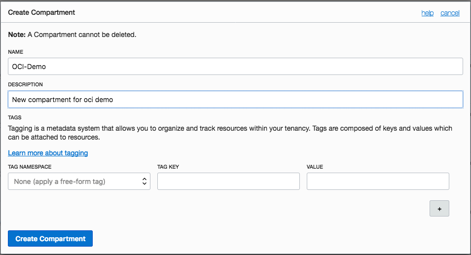

3. Now, let’s **create a policy** that gives your group permissions in your assigned compartment. For example, creates a policy that gives permission to compartment OCI-Demo to members or group oci-group:

   a) In the Console, click **Identity**, and then click **Policies**.

   b) On the left side, select your **OCI-Demo** compartment.

   c) Click **Create Policy**.

   d) Enter a unique **Name** for your policy (For example, "Policy-for-oci-group") Note that the name can NOT contain spaces.

   e) Enter a **Description** (for example, "Policy for OCI Group").

   f) Enter the following **Statement**:

Allow group oci-group to manage all-resources in compartment OCI-Demo

   g) Click **Create**.

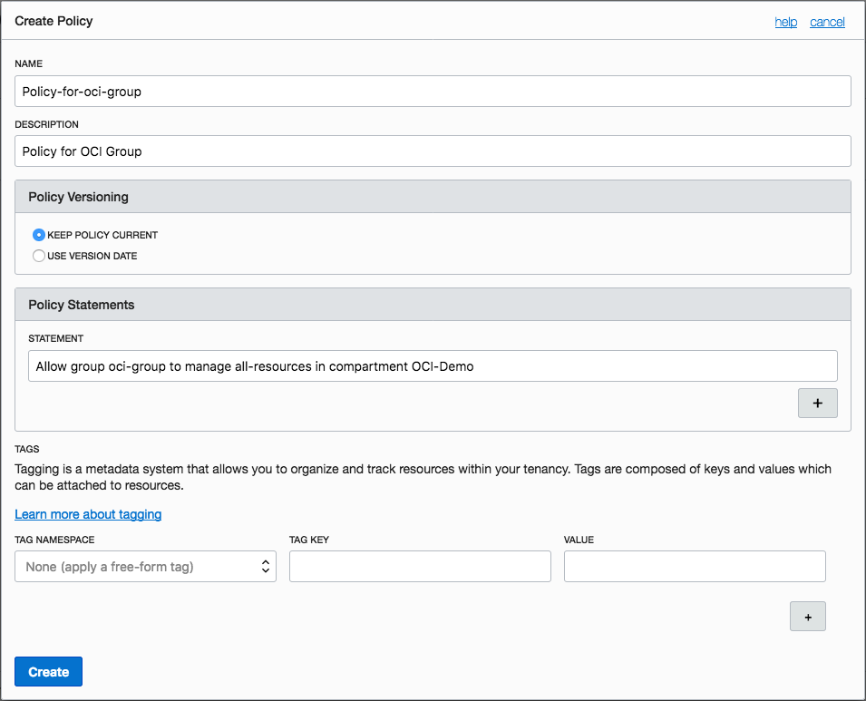

4. Create a New User

   a. In the Console, click **Identity**, and then click **Users**.

   b. Click **Create User**.

   c. In the **New User** dialog box, enter the following:

    * **Name:** Enter a unique name or email address for the new user. For Example: yourname@oracle.com

         _This value is the user's login name for the Console and it must be unique across all other users in your tenancy._

    * **Description:** Enter a description. For example, New oci user.

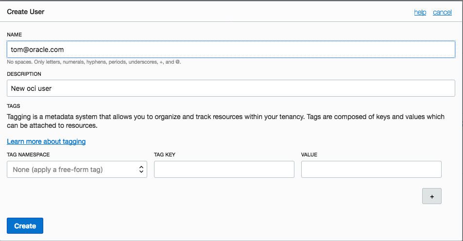

   d) Click **Create**.

5. Set a Temporary Password for the Newly Created User

   a) From the list of users, click on **the user that you created** to display its details.

   b) Click **Create/Reset Password**.  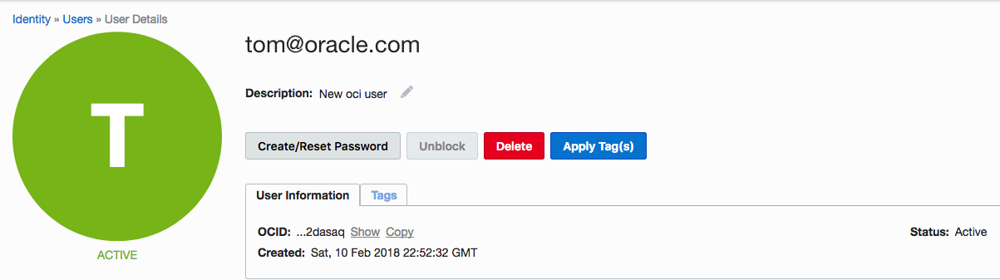

   c) In the dialog, click **Create/Reset Password**.

    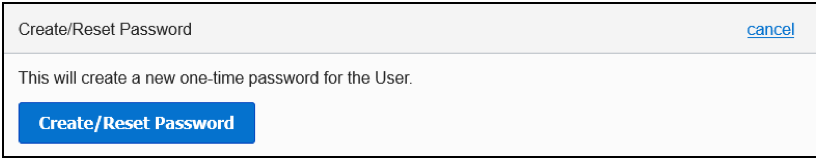

   d) The new one-time password is displayed.

    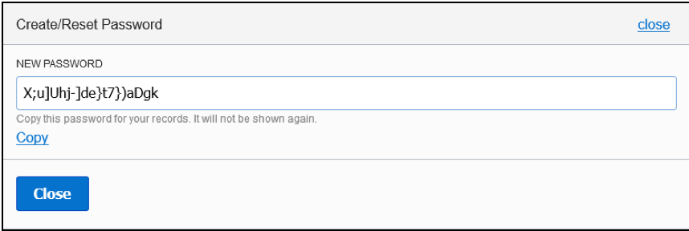

   e) Click the **Copy** link and then click **Close**. Make sure to copy this password to your notepad.

6. Sign out

   a) Click **Sign Out** from the user menu and log out of the cloud.admin user account.

    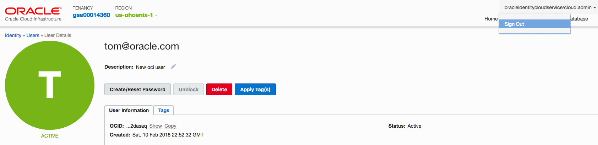

7. Sign in as the new yourname@oracle user using a different web browser window.

   a) Go to [https://console.us-ashburn-1.oraclecloud.com](https://console.us-ashburn-1.oraclecloud.com).

   b) Enter the Tenant name, if prompted.

   c) Sign in as yourname@oracle.com.

   d) Enter the password that you copied in [Task 4](#passwrdlabuser01).

   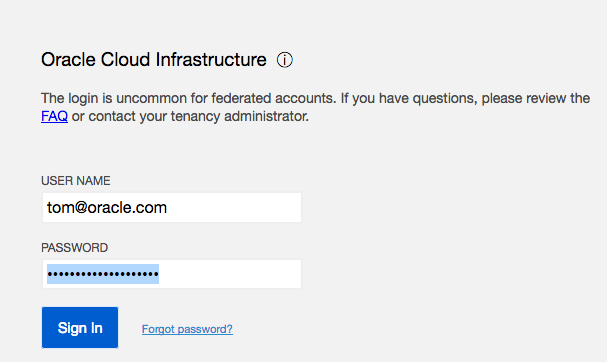

    **Note:** _Since this is the first-time sign-in, the user will be prompted to change the temporary password, as shown in the screen capture._

   e) Set the new password to _Welc0me2*bmcs_. Click **Save New Password**.

    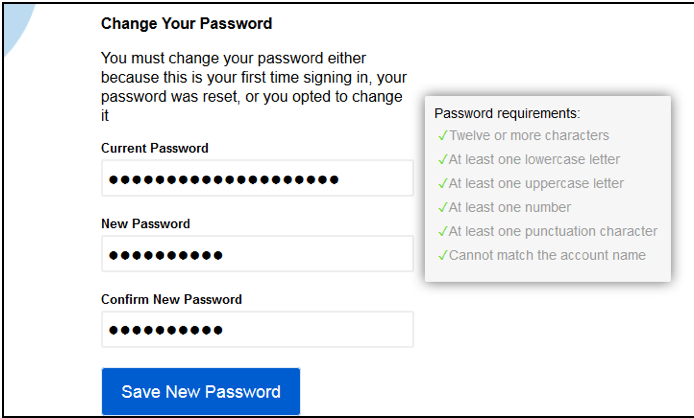

   f) yourname@oracle.com lands on the home page.

8. Verify user permissions

   a) Go to the **Compute** tab and click on **Instances**.

   b) Select compartment OCI-Demo from the left menu, if it's not already selected.

   c) The message “**You don’t have access to this compartment**” appears.

   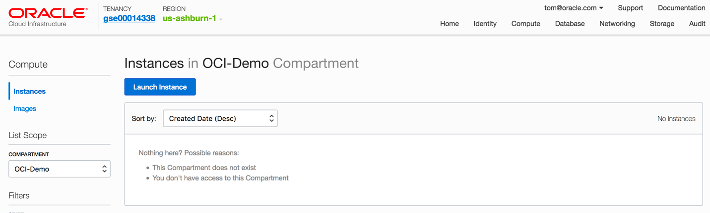

   d) Sign out of the Console.

9. Add User to a Group

   a) Sign in back as the cloud.admin using the Single Sign-on (SSO) option. Click **Identity** \> **Users**.

   b) From the **Users** list, click your user (for example, yourname@oracle.com)  to go to the user details page.

   c) Under the **Resources** menu on the left, click **Groups.**

   d) Click **Add User to Group**.

   e) From the **GROUPS** drop-down list, select the **oci-group** that you created.

   f) Click **Add**.

   g) Sign out.

10. Verify user permissions when a user belongs to a specific group

    a) Sign in as yourname@oracle.com

    b) Go to the **Compute** tab and click **Instances.**

    c) Select compartment **OCI-Demo** from the list of compartments on the left.

    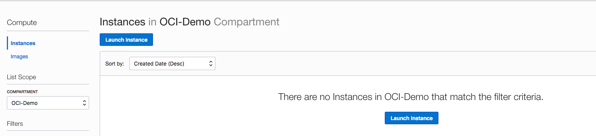

    d) There is no message related to permissions.

    e) Go to the **Identity** tab and select **Groups.**

    f) The message “You don’t have access to these resources” appears. This is expected, since your user has no permission to any groups.

    g) Sign out.